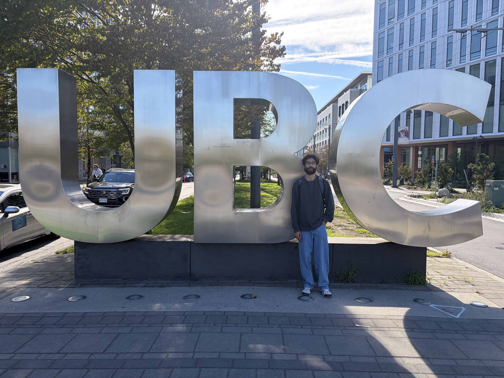

Since this was my first time on the UBC campus, I was very excited before orientation as I was about 
to begin my journey in the MDS program. During orientation, I enjoyed the bingo game we played and was able to win a gift card! I
met so many amazing people who were all about to start this journey with me for the next 10 months. After orientation ended, I took some time 
to explore UBC and visit the IKB, Koerner library, the clock tower, the nest, and many other locations. 

My first week started out pretty sound. I enjoyed coming to campus and studying together with my new friend group with 3 other MDS students. 
The class that I think I will enjoy the most in Block 1 is Statstics as well as Platforms in Data Science. I am nervous about quizzes starting next week but I hope that I can do my best. 
Each day after class, me and my friends go and study together at the IKB and we have slowly begun to form a bigger friend group with other MDS students as of more recently. 
I also bought a fitness membership with UBC recreation so I hope I can explore camopus more by going to the gym, and playing sports. 

Overall, my first week of the MDS program was amazing. I feel very connected with everyone on campus and I hope that they will stay 
as friends with me for a long time. I am looking forward to the rest of the program, although I know that it will not be easy. However, I am committed to succeed
and power through no matter the cost. 